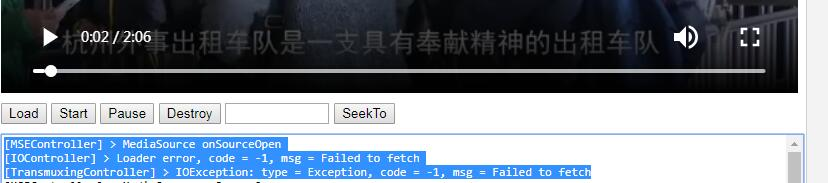

## 说明
> 本着学习的目的(typeScript、以及更高的知识点)，于是使用TypeScript重写  @xxk 的flv.js ，原项目 https://github.com/Bilibili/flv.js  ，由于是个人学习的项目，这里强烈不推荐用于生产环境！

> 本来fork 原项目，在上面改动的，结果发现clone 不下来，一直try again (y/n)，于是启用新项目来开发。


---------------------------------------------------------------------
## 如何使用该项目
```shell 
git clone https://github.com/veaba/typescript-flv.js.git
npm install 
npm run dev  # 会启动一个前台的服务器web页面，8081，并自动生成在内存里面的执行index文件，TODO 后续会生成dist文件夹，比较直观点

```
## 安排src目录 `♪(^∇^*) `(抄人家的~~ )
```text
--/src    
   -- /core
   -- /demux
   -- io
   -- /player
   -- /remux
   -- /utils
   

```
---------------------------------------------------------------------
## 如何安排从头开始的构建工作？
`const player = flv.createPlayer()`->`player.attachMediaElement(element)`->`player.play()`
> init如果失败
- init
	- [MSEController] > MediaSource onSourceOpen 打开媒体源，不一定成功，可以能失败
	- [IOController] > Loader error, code = -1, msg = Failed to fetch 拉取失败
	- [TransmuxingController] > IOException: type = Exception, code = -1, msg = Failed to fetch//传动失败，发送异常，代码-1，描述 拉取失败
	


- load 视频
	- [MSEController] 
	> MediaSource onSourceOpen 打开资源
	- [FLVDemuxer] 
	> Parsed onMetaData 解析元数据
	- [FLVDemuxer] 
	> Parsed AVCDecoderConfigurationRecord AVC解码器配置记录
	- [FLVDemuxer] 
	> Parsed AudioSpecificConfig 解析音频特定配置
	- [MSEController] 
	> Received Initialization Segment, mimeType: video/mp4;codecs=avc1.64001e 收到视频初始化数据，类型巴拉巴拉
	- [MSEController] 
	> Received Initialization Segment, mimeType: audio/mp4;codecs=mp4a.40.5 收到音频初始化数据，类型巴拉巴拉
	- [MSEController] 
	> MediaSource onSourceEnded 媒体资源解析完毕
## flv 函数结构
```js

// 向window 提供的函数
// flv_destory(){},
// flv_load(){},
// flv_load_mds(){},
// flv_pause(){},
// flv_seekto(){}
// flv_start(){}
// flvsjs 构造函数
const flvjs = {
    BaseLoader(){},
    ErrorDetails:{},
    ErrorTypes:{},
    FlvPlayer(){},
    LoaderError:{},
    LoaderStatus:{},
    LogginControl(){},
    NativePlayer(){},
    createPlayer(){},
    getFeatureList(){},
    isSupported(){},
    version:String
}
// flve.js 实例
```
## 视频格式与浏览器的支持情况

- MP4 H.264视频编码、AAC音频编码的 MPEG 4 文件
- WebM VP8视频编码、Vorbis音频编码的 WebM文件
- Ogg Theora视频编码、Vorbis音频编码的Ogg文件

|浏览器|MP4|WebM|Ogg|
|----|----|----|----|
|IE|√|x|x|
|Chrome|√|√|√|
|Firefox|√|√|√|
|Safari|√|x|x|
|Opera|(25起)√|√|√|
|||||

## demo框架
### dev
- webpack
- webpack-cli
- webpack-dev-middleware
- webpack-hot-middleware
- express
- ts-loader
- json-parse-better-errors  什么玩意？
- neo-async  ???
- webpack-sources  ? 
- loader-runner ??
- watchpack  ?
- mkdirp
- acorn-dynamic-import ?
- acorn
## 规划与设计
```txt
    dist/
    ---- flvts.min.js   //压缩过的代码
    ---- flvts.all.js   //格式化的代码
    src/
    ---- core/      //核心代码
    ---- demux/     // 混码？不太明白啥意思，只有一丢丢video相关的概念
    ---- io/        // 输入输出，干吗的？(⊙o⊙)…
    ---- player/    // 播放器
    ---- remux/     // 似乎和demux 是相反的意思~
    ---- utils/     // 工具类函数
    ---- flvts.js
    ---- index.ts
    READEME.md 
```
## 吐槽
## 知识点&专业词汇
|en|desc|todo|
|----|----|----|
|demux|||
|demuxer|ffmpeg接口,视音频分离器||
|muxer|ffmpeg接口，视音频复用器，其实是将音轨和视频画面合并起来的意思吗？||
|remux|ffmpeg,封装格式转换||
|h.264|||
| [MSE](./docs/MSE) |Media Source Extensions API |媒体源拓展API。无需插件就可以基于web的流媒体功能|
| [MediaSource](./docs/MediaSource) |媒体资源API,一个包含即将播放的媒体文件和准备状态等信息的容器|见./docs/MediaSource.md也可见MDN|
|SourceBuffer|对象，代表多个组件整个串流的不同媒体块||
|MIME|多用途互联网邮件拓展类型|一个字符串类型，定义一些规格:video/mp4; codecs="avc1.42E01E, mp4a.40.2"|
|HTMLMediaElement||https://developer.mozilla.org/zh-CN/docs/Web/API/HTMLMediaElement|
|HTMLVideoElement|继承自HTMLMediaElement|https://developer.mozilla.org/zh-CN/docs/Web/API/HTMLVideoElement|
|HTMLAudioElement|访问`<audio>`元素|https://developer.mozilla.org/zh-CN/docs/Web/API/HTMLAudioElement|
## LICENSE
> 我应该可以这么做吧~~（用typescript重写别人的项目~~，不太懂，有问题请联系我。）
原项目 https://github.com/Bilibili/flv.js   Bilibili /flv.js

Apache LICENSE 2.0


## Reference（参考索引）

`@1` https://blog.csdn.net/leixiaohua1020/article/details/39802819
